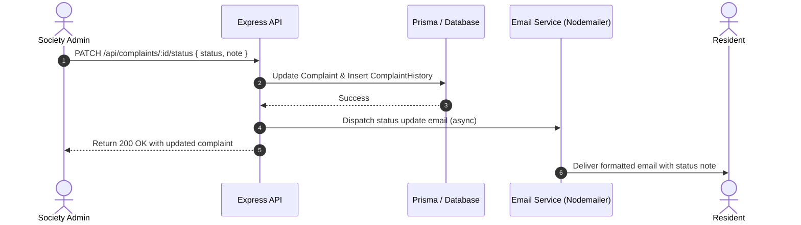

# ?? System Design Document: Society Maintenance Tracker

**Author:** Society Maintenance Engineering  
**Scope:** Core architecture, audit trail history model, dynamic overdue calculation, photo handling pipeline, and notification event flow.  
**Word Count:** ~650 words  

---

## 1. Architectural Overview

The Society Maintenance Tracker is designed around a three-tier decoupled client-server architecture with role-based access control (RBAC):
1. **Presentation Layer (React + Tailwind CSS):** Single-page application providing responsive interfaces for Residents and Admins with real-time UI status reflections and metric visualizations.
2. **Application Layer (Node.js / Express / TypeScript):** Modular REST API following a Controller-Service-Repository pattern. Encapsulates authentication, domain validation, file storage middleware, and notification services.
3. **Persistence Layer (Prisma ORM + Relational DB):** Normalised schema with foreign keys, indexing on frequent filter attributes (`status`, `category`, `priority`, `createdAt`), and an append-only audit trail table.

---

## 2. Complaint Status Lifecycle & History Model

The complaint lifecycle follows a strict state transition flow:
$$\text{OPEN} \longrightarrow \text{IN\_PROGRESS} \longrightarrow \text{RESOLVED (Closed)}$$

### Data Modeling:
Rather than merely updating a status column in-place, every mutation is recorded in a dedicated `ComplaintHistory` table:

```
[Complaint] 1 -----------< N [ComplaintHistory]
                            +-- id (UUID, PK)
                            +-- complaintId (FK)
                            +-- actorId (FK -> User)
                            +-- action (CREATED | STATUS_CHANGE | PRIORITY_CHANGE)
                            +-- fromStatus, toStatus
                            +-- fromPriority, toPriority
                            +-- note (Admin remark / technician note)
                            +-- createdAt (Timestamp)
```

### Key Design Benefits:
- **Immutable Audit Trail:** Complete non-repudiation. Residents and auditors can see exactly who changed a status, when it happened, and why (via attached notes).
- **Resolution Velocity Analytics:** Time deltas between creation, in-progress assignment, and final resolution allow society committees to benchmark vendor performance.
- **Atomic Operations:** Prisma transaction wrappers ensure the complaint record and history log update atomically.

---

## 3. Dynamic Overdue Detection & SLA Management

Traditional systems rely on heavy cron jobs or periodic workers that write `isOverdue = true` into rows. This causes race conditions, time-drift, and stale state when threshold settings are changed.

### Dynamic Computation Engine:
Our system utilizes a **computed SLA evaluation algorithm** at query time, backed by configurable society settings:

$$\text{Days Open} = \left\lfloor \frac{\text{Current Time} - \text{Created At}}{86,400,000 \text{ ms}} \right\rfloor$$

$$\text{isOverdue} = (\text{Status} \neq \text{"RESOLVED"}) \land (\text{Days Open} \ge \text{Threshold Days})$$

### Admin Queue Surfacing:
Complaints are ranked in the admin view using a multi-factor priority sorting comparator:
1. **Overdue Flag First:** $(\text{isOverdue} = \text{true}) \succ (\text{isOverdue} = \text{false})$.
2. **Active State:** $\text{OPEN / IN\_PROGRESS} \succ \text{RESOLVED}$.
3. **Priority Weight:** $\text{HIGH (3)} \succ \text{MEDIUM (2)} \succ \text{LOW (1)}$.
4. **Recency:** $\text{Created Date Descending}$.

Admins can also dynamically configure the SLA threshold (e.g. 1 to 30 days) via the `/api/settings` endpoint without restarting the application.

---

## 4. Photo Upload & Attachment Pipeline

Photos provide immediate visual context for plumbing leaks, cracked tiles, and broken elevators.

### Pipeline:
1. **Multipart Handling:** Handled via `multer` storage middleware with strict MIME-type validation (`image/jpeg`, `image/png`, `image/webp`) and file size limits (5MB).
2. **Storage Abstraction:** Uploaded assets receive randomized collision-proof filenames (`photo-<timestamp>-<rand>.<ext>`) stored in the static `/uploads` volume and exposed via Express static asset middleware.
3. **Cloud Readiness:** The URL format (`/uploads/filename`) easily swaps with cloud object storage (AWS S3, Cloudinary, or Supabase Storage) by replacing the upload handler.

---

## 5. Notification & Email Event Flow

The system employs an asynchronous event notification flow triggered by business state transitions:



- **Status Transition Alert:** When an admin marks a complaint In Progress or Resolved, the resident receives an email with the status change and administrative note.
- **Important Notice Broadcast:** When a notice is marked `isImportant: true`, the system broadcasts the announcement to all registered residents.
- **Zero-Config Developer Experience:** Automatically creates ephemeral test accounts on Ethereal Mail if no SMTP credentials are provided, printing one-click preview URLs in the server console for immediate testing.
